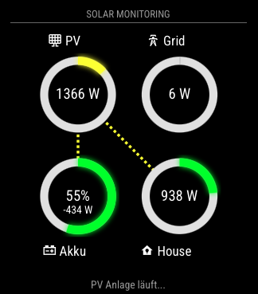
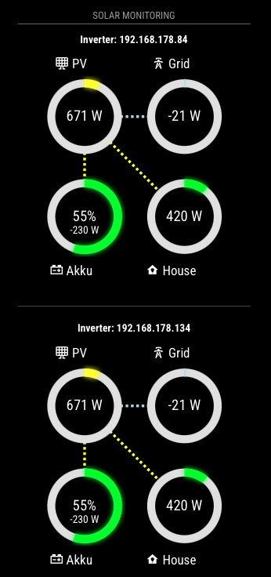

# MMM-FroniusSolar5

The MMM-FroniusSolar5 module is an advanced evolution of the MMM-FroniusSolar family, specifically designed for [MagicMirror²](https://magicmirror.builders/) to monitor and visualize solar energy data from multiple Fronius inverters simultaneously. Building upon the animated flow visualization of [MMM-FroniusSolar2](https://github.com/ChrisF1976/MMM-FroniusSolar2), this version adds comprehensive support for systems with multiple inverters while maintaining all the dynamic visualization features.


## Key Enhancements Over MMM-FroniusSolar2

**1. Multi-Inverter Support**
- Monitor multiple Fronius inverters simultaneously
- Aggregate data across all inverters for a complete system view
- Option to display individual inverter data side-by-side
  
**2. Enhanced Data Processing**
- Smart aggregation of power values (sum of all inverters)
- Intelligent SOC (State of Charge) averaging for battery systems

**3. Improved Configuration**
- `InverterIPs` array replaces single `InverterIP`
- New `ShowIndividualInverters` toggle for display modes


##  Features

- Multi-Inverter Visualization:
  - Combined view showing total system performance
  - Optional individual inverter displays with IP identification
  - Automatic data aggregation for P_Akku, P_Grid, P_Load, and P_PV
- Dynamic Gauges (retained from v2):
  - Real-time animated SVG gauges for all power flows
  - Color-coded based on energy direction (consumption vs production)
  - Configurable maximum power values for proper scaling
- Animated Flow Lines:
  - Dashed-line animations showing energy pathways
  - Automatic direction changes based on power flow
  - Color-coded by energy source/destination
- Smart Messaging System:
  - Context-aware text messages based on grid interaction
  - Fully customizable message thresholds and content
  - Color-coded urgency levels

## Screenshot
These are live pictures. The sum of the second picture doesn't match with the first of course. :-)
**`ShowIndividualInverters: false,`**

- Combined view showing total system performance



**`ShowIndividualInverters: true,`**

- Individual inverter display mode




---

## Installation
1. Clone the repository into your MagicMirror/modules directory:
   
```bash
   cd ~/MagicMirror/modules
   git clone https://github.com/ChrisF1976/MMM-FroniusSolar5.git
```
   
2. Install dependencies:
```bash
cd MMM-FroniusSolar5
npm install
```


## Configuration
Add the module to the `config.js` file:

```bash
{
		    module: "MMM-FroniusSolar5",
		    position: "bottom_center",
		    header: "Solar Monitoring",
		    config: {
		        InverterIPs: ["192.168.178.134", "192.168.178.84"], // Array of inverter IPs
		        updateInterval: 5*1000,
		        width: "300px",
		        icons: {
		            P_Akku: "mdi:car-battery",
		            P_Grid: "mdi:transmission-tower",
		            P_Load: "mdi:home-lightbulb",
		            P_PV: "mdi:solar-panel-large"
		        },
		        Radius: 50,
		        MaxPower: 4000,
		        MaxPowerPV: 10400,
		        ShowText: true,
		        ShowIndividualInverters: false, // Set to true to show each inverter separately
		        TextMessge: [
		            		{ about: "600", Text: "Leicht erhöhter Netzbezug.", color: "#999" },
							{ about: "1000", Text: "Na Na Na. Über 1 KW Netzbezug!", color: "#ffffff" },
							{ about: "1500", Text: "Zu Wenig Sonne. Über 1,5KW Netzbezug. Warten?", color: "#eea205" },
							{ about: "2500", Text: "Muss das wirklich sein? Über 2,5KW aus dem Netz!", color: "#ec7c25"},
							{ about: "5000", Text: "Auto lädt, richtig? Nächstes Mal auf Sonne warten.", color: "#cc0605"},
							{ less: "-500", Text: "Sonne scheint! Mehr als 500W frei.", color: "#f8f32b" },
							{ less: "-2000", Text: "Wäsche waschen! Über 2KW freie Energie!", color: "#00bb2d"},
							{ less: "-4000", Text: "Auto laden! Über 4KW freie Energie!", color: "f80000"}, 
		        ],
		    },
		},
```

### Configuration Options

| **Option**        | **Default**       | **Description**                                                                   |
|-------------------|-------------------|-----------------------------------------------------------------------------------|
| `InverterIPs`     | `[]`              | Array of inverter IP addresses.                                                   |
| `ShowIndividualInverters`  | `false`  | When true, shows each inverter's data separately                                  |
| `updateInterval`  | `5*1000` (5 sec)  | Time interval (in milliseconds) between data updates from the Fronius system.     |
| `icons`           | N/A               | Define custom Icons for power flow elements - [Iconify](https://iconify.design)   |
| `Radius`          | `120`             | Radius of the SVG gauges (in pixels).                                             |
| `MaxPower`        | `4000`            | Maximum power value for scaling P_Grid and P_Load gauges.                         |
| `MaxPowerPV`      | `10400`           | Maximum power value for scaling P_PV (solar panel power).                         |
| `ShowText`        | `true`            | Enable or disable dynamic text messages below the gauges.                         |
| `TextMessge`      | `[]`              | Array of objects defining conditional text messages based on P_Grid values.       |

#### Text Message Format

| **Key**   | **Description**                                                     |
|-----------|---------------------------------------------------------------------|
| `about`   | Display the message when P_Grid exceeds this value.                 |
| `less`    | Display the message when P_Grid is below this value.                |
| `Text`    | The message to display.                                             |
| `color`   | Color of the message text (hex or CSS color names).                 |


## How It Works

### Data Retrieval
- Fetches real-time data from the Fronius system using the `node_helper.js` backend.

### Visualization
- Gauges are created using SVG, displaying current values and percentages.

### Animated Flow Lines
Power flows between elements (e.g., PV → Grid, PV → House) are represented as animated dashed lines.

### Dynamic Messages
- Displays context-sensitive messages based on `P_Grid` values.

## Styling

Custom styles can be adjusted in the `MMM-FroniusSolar2.css` file.

### House Gauge Color Logic

| **Condition**                        | **Color**    | **Description**                                                                                         |
|--------------------------------------|--------------|---------------------------------------------------------------------------------------------------------|
| `P_Akku - 100 > abs(P_Grid)`         | `#a3c49f`    | **Light green**: High battery activity is contributing significantly to the house's energy consumption. |
| `P_Grid > 150`                       | `#808080`    | **Gray**: High grid consumption is being used to power the house.                                       |
| `outerPower > 0`                     | `#00ff00`    | **Green**: Positive power flow (house is self-sufficient or partially consuming generated energy).      |
| `outerPower < 0`                     | `#add8e6`    | **Light blue**: Energy is being exported to the grid (surplus power).                                   |


## Dependencies

- [MagicMirror²](https://magicmirror.builders/)
- Fronius Symo GEN24 with activated SolarApi.

---

## Common Features of MMM-FroniusSolar(X)

All five modules, [MMM-FroniusSolar](https://github.com/ChrisF1976/MMM-FroniusSolar), [MMM-FroniusSolar2](https://github.com/ChrisF1976/MMM-FroniusSolar2), [MMM-FroniusSolar3](https://github.com/ChrisF1976/MMM-FroniusSolar3), [MMM-FroniusSolar4](https://github.com/ChrisF1976/MMM-FroniusSolar4) and [MMM-FroniusSolar5](https://github.com/ChrisF1976/MMM-FroniusSolar5), are designed to display solar energy data. They share several configurations and CSS properties:

- **Configuration Settings**: Each module displays metrics such as `P_Akku`, `P_Grid`, `P_Load`, and `P_PV` using configurable icons and messages.
- **Dynamic SVG Gauges**: All modules include gauges to represent power flow visually.
- **Text Messages**: Each module uses conditional text messages based on `P_Grid` values.

## Recommended Use Cases

- **[MMM-FroniusSolar](https://github.com/ChrisF1976/MMM-FroniusSolar)**: Best for simple setups prioritizing clarity and minimalism.
- **[MMM-FroniusSolar2](https://github.com/ChrisF1976/MMM-FroniusSolar2)**: Suitable for scenarios requiring visual feedback on power flows (e.g., monitoring dynamic energy consumption).
- **[MMM-FroniusSolar3](https://github.com/ChrisF1976/MMM-FroniusSolar3)**: Ideal for larger or customizable displays where scalability and enhanced readability are critical.
- **[MMM-FroniusSolar4](https://github.com/ChrisF1976/MMM-FroniusSolar4)**: Similar to #2 but adds a Shelly support for monitoring small balcony solar systems.
- **[MMM-FroniusSolar5](https://github.com/ChrisF1976/MMM-FroniusSolar5)**: Similar to #2 but monitors and visualize solar energy data from multiple Fronius inverters simultaneously

---

## License

This module is distributed under the [MIT License](LICENSE). See LICENSE for more details.
